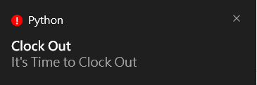

# GoHomeCountdown
## What is this?
This is used to count down how much time is left until the end of the workday. If the end of the workday is reached, a reminder will notify you to clock out.

## Support Language
English  
简体中文  
繁體中文  
日本語    

## What packages need to be installed?
Refer to the requirements.txt.

## How will I be notified to clock out?
The go_home_clock_in function will automatically open a webpage (you can modify the _URL content if your company’s clock-in system is web-based).  
The taskbar will flash if the window is not in the foreground.  
A notification will be sent as long as Windows notifications are not disabled.  

## What can I expand its functionality?
### Example  
Use the winreg package to set the program to start automatically when the computer boots up.

## What if I want to automate the clocking out process?
You can modify the contents of the go_home_clock_in function according to your needs.  

## How do I change the clock-in hours?
Modify the value of _HOURS. If you need to use minutes, you will also need to modify any references to _HOURS.

# Display:

  

