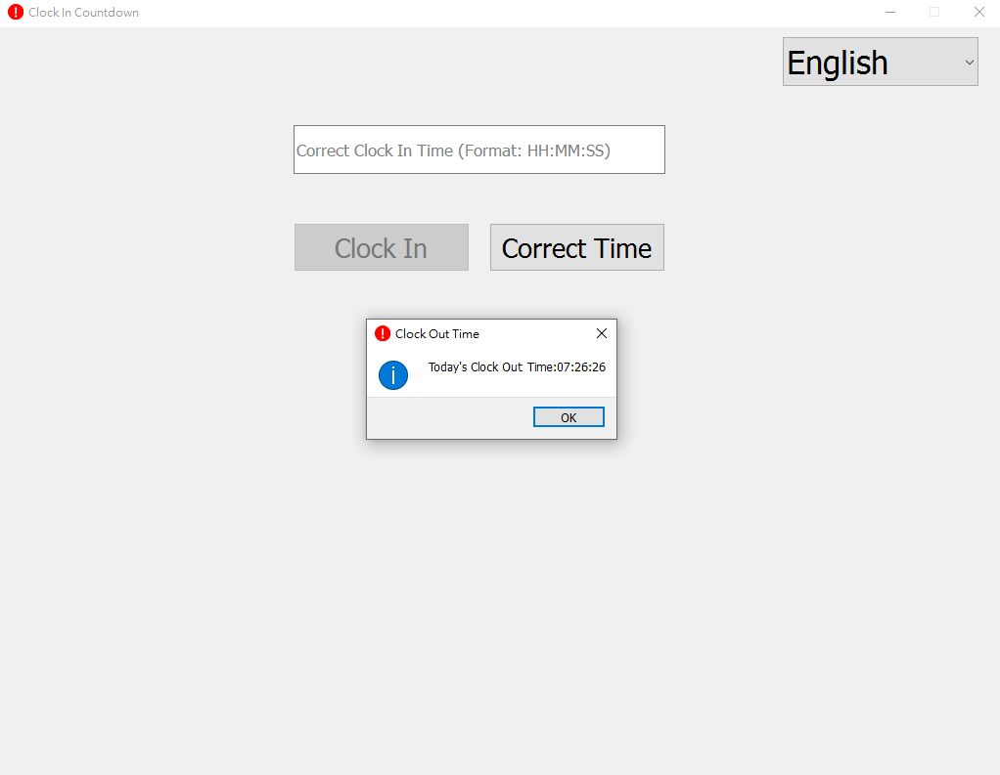
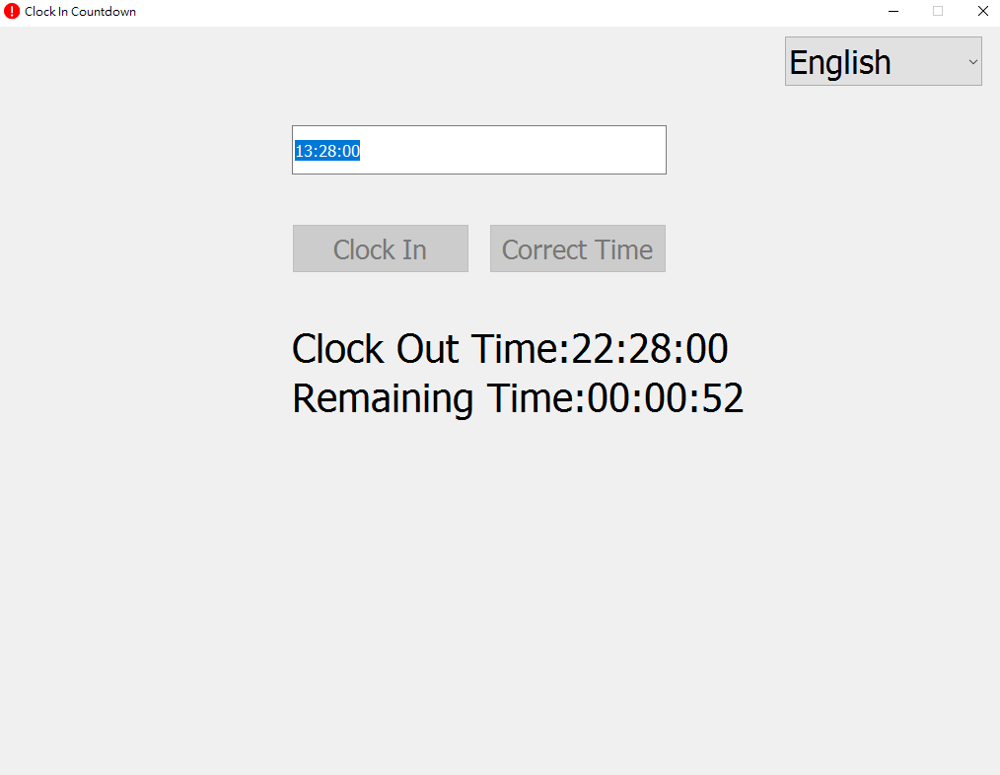
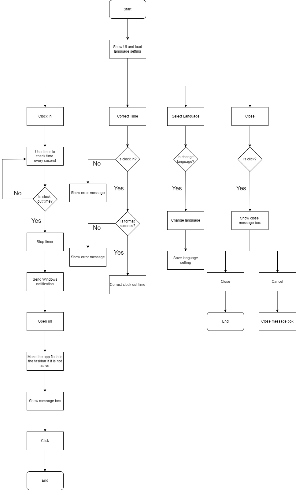

# GoHomeCountdown
## Overview
This application counts down the remaining time until the end of the workday.  
When the workday concludes, a reminder will notify you to clock out.

## Supported Languages
### English  
### 简体中文  
### 繁體中文  
### 日本語    

## Required Packages
Please refer to the `requirements.txt` file for the list of packages to be installed.

## Notification Mechanism
1. The `go_home_clock_in` function will: Automatically open a webpage (you can modify the `_URL` variable if your company’s clock-in system is web-based).  
2. Flash the taskbar if the window is not in the foreground.  
3. Send a notification, provided that Windows notifications are enabled.   

## Expanding Functionality
### Suggestions for Additional Features  
1. You can use the `winreg` package to set the program to start automatically when the computer boots up.  
2. Automatically shut down your computer when receiving a notification.
3. Add support for additional languages. 

## Automating the Clocking Out Process
You can modify the contents of the `go_home_clock_in` function to suit your specific needs or customize it based on your ideas.  

## Changing Clock-In Hours
To change the clock-in hours, modify the value of `_HOURS`.  
If you need to include minutes, ensure you also update any references to `_HOURS` accordingly.    

# Display:
The following images illustrate several situations of the application:  
  

  

# Flow:
The flow diagram below shows the overall process: 
  

