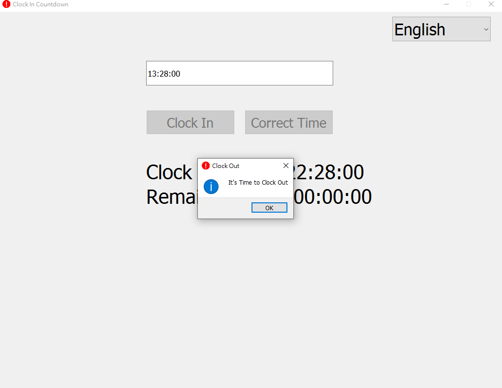

# GoHomeCountdown
## 這是什麼?
這是用來倒數離下班還有多久時間，若下班時間到了會提醒該要打卡了

## 需要安裝哪些套件
參考 requirements.txt  

## 怎麼通知該打下班卡了?
1.在go_home_check_in函數裡會自動開啟一個網頁(如果公司打卡系統是用網頁的話可修改_URL內容)  
2.在視窗沒有在最上層時，工具列會發光  
3.在windows通知未關閉的情況下會發送一個通知

## 還能怎麼擴充功能?
1.使用winreg套件將讓程式開機時自動啟動

## 想自動打卡怎麼辦?
可根據自身需求修改go_home_check_in函數的內容

## 怎麼修改打卡時數?
修改_HOURS的值  
若有分鐘需求則需修改引用到_HOURS的地方

# 展示

